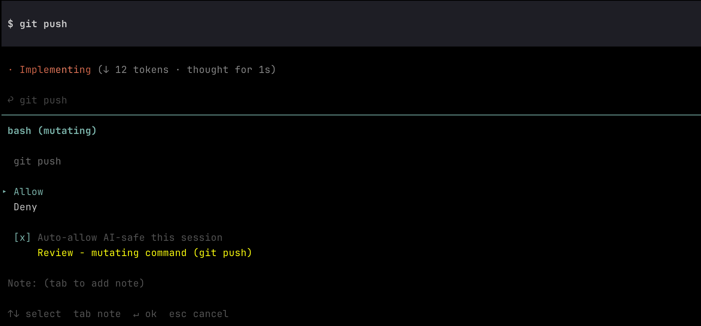
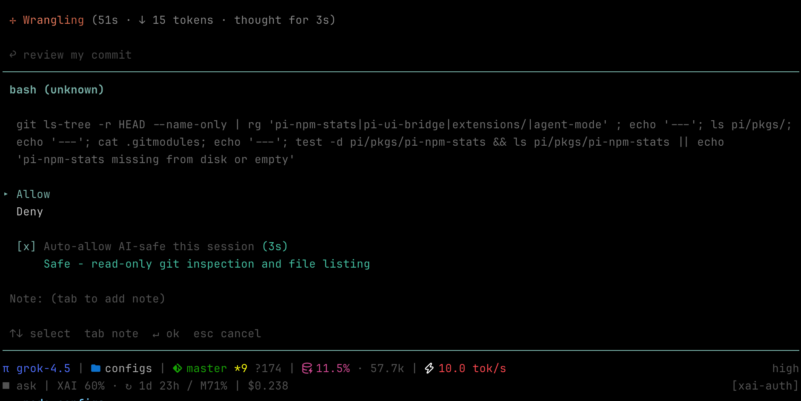
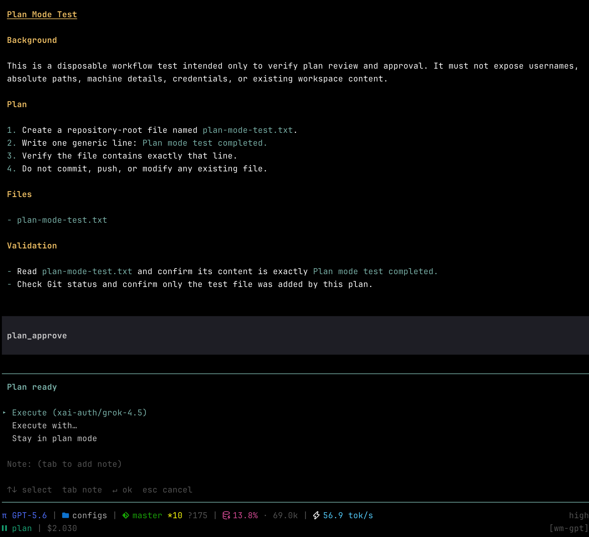

# pi-run-mode

**ask / plan / auto run modes for pi — permission gate, plan lifecycle, and AI bash review.**

[](https://opensource.org/licenses/MIT)

> Not published to npm yet. Install from GitHub or a local path.

## Why

Pi starts open by default. pi-run-mode adds three run modes so you can stay in flow without giving every tool call free rein:

| Mode | Behavior |
|------|----------|
| **ask** | Writes and risky bash need approval (diff/patch preview). Optional AI review can auto-allow read-only bash. |
| **plan** | Read-only exploration. Only the session plan file may be written. Model enters via `plan_start` and exits via `plan_approve`. |
| **auto** | Writes and most bash run freely; risky bash still prompts (Allow once / Allow session / Deny). |

Cross-mode **hardDeny** blocks sensitive paths and dangerous bash with no prompt.

### Ask mode — bash review

In **ask**, mutating/risky bash opens an approval dialog. AI review is advisory (never self-approves); with **Auto-allow AI-safe this session** checked, a **safe** verdict starts a short countdown and auto-submits Allow.

**Review (needs human):**



**Safe (auto-allow countdown):**



### Plan mode — approve to execute

In **plan**, the model writes a plan file then calls `plan_approve`. You choose **Execute** (current auto model), **Execute with…** (pick model), or **Stay in plan mode**.



## Install

From GitHub (until npm publish):

```bash
pi install git:https://github.com/ouzhenkun/pi-run-mode.git
```

Local development (this repo as a package path):

```bash
pi install ./pkgs/pi-run-mode
```

Or add to `~/.pi/agent/settings.json`:

```json
{
  "packages": ["./pkgs/pi-run-mode"]
}
```

Reload with `/reload` or restart pi.

## Usage

| Action | How |
|--------|-----|
| Show mode | `/run-mode` |
| Set mode | `/run-mode ask` · `/run-mode plan` · `/run-mode auto` |
| Cycle mode | `/run-mode toggle` (or configured shortcut) |
| Start in plan | `pi --plan` |

No cycle shortcut is registered by default — pi already uses `Shift+Tab` for
thinking level. Set `cycleShortcut` in config if you want a key (and free that
key from pi's `keybindings.json` if needed).

### Plan tools (model-driven)

| Tool | Purpose |
|------|---------|
| `plan_start` | Enter plan mode (read-only transition; no confirm) |
| `plan_approve` | Request exit: Execute / Execute with… / Stay |

Plan content is written to `~/.pi/agent/plans/<sessionId>.md`.

## Configuration

Create `~/.pi/agent/pi-run-mode.json`:

```json
{
  "cycleShortcut": "alt+m",
  "modeModels": {
    "ask": { "provider": "xai-auth", "id": "grok-4.5" },
    "plan": { "provider": "anthropic", "id": "claude-sonnet-4" },
    "auto": { "provider": "xai-auth", "id": "grok-4.5" }
  },
  "syncModels": ["ask", "auto"],
  "hardDeny": {
    "read": [".env", ".env.*", "*.pem", "*.key", "~/.ssh/id_*"],
    "write": [".env", ".env.*", "*.pem", "*.key", "~/.ssh", "~/.aws/credentials"],
    "bash": []
  },
  "aiReview": {
    "autoApproval": true,
    "provider": "deepseek",
    "model": "deepseek-v4-flash"
  }
}
```

| Field | Description |
|-------|-------------|
| `cycleShortcut` | Optional key chord to cycle modes (e.g. `alt+m`). Omit / `null` / `""` = command only. Change requires `/reload`. |
| `modeModels` | Per-mode model binding; restored on mode switch / session start |
| `syncModels` | Modes that share one model (changes propagate across the group) |
| `hardDeny.read/write` | Glob-ish path denylist (basename patterns match any dir) |
| `hardDeny.bash` | Substring / regex-source denylist against raw commands |
| `aiReview` | Model used for ask-mode bash safety advisory; `autoApproval` seeds the session checkbox |

Session state (current mode + `modeModels`) is also persisted in the session log.

## Events

pi-run-mode only emits its own bus names (no hard dependency on other packages).
Wire a thin bridge if you want footer / desktop notify / next-cue integration.

| Event | Payload | When |
|-------|---------|------|
| `pi-run-mode:mode` | `{ label: string \| null }` | Mode changes (ask → `null`) |
| `pi-run-mode:notify` | `{ type?, title, body, sound?, … }` | Approval wait, plan ready, input needed |
| `pi-run-mode:modal` | `{ phase: "open" \| "close" }` | Plan approval dialog open/close |

## Architecture

```
index.ts          bootstrap + session restore
core/             runtime state, persistence, model binding
modes/            setMode, optional cycle shortcut, /run-mode, indicators
plan/             plan tools, lifecycle hooks, plan file, prompt
permission/       tool_call gate, policy, approve dialogs, bash classifier
review/           AI bash review, model picker
```

## Notes

- Subagent / headless sessions without UI re-decide under **auto** rules; actions that would still prompt are blocked.
- AI review never self-approves: timeout, abort, or failure → human prompt.

## License

MIT
